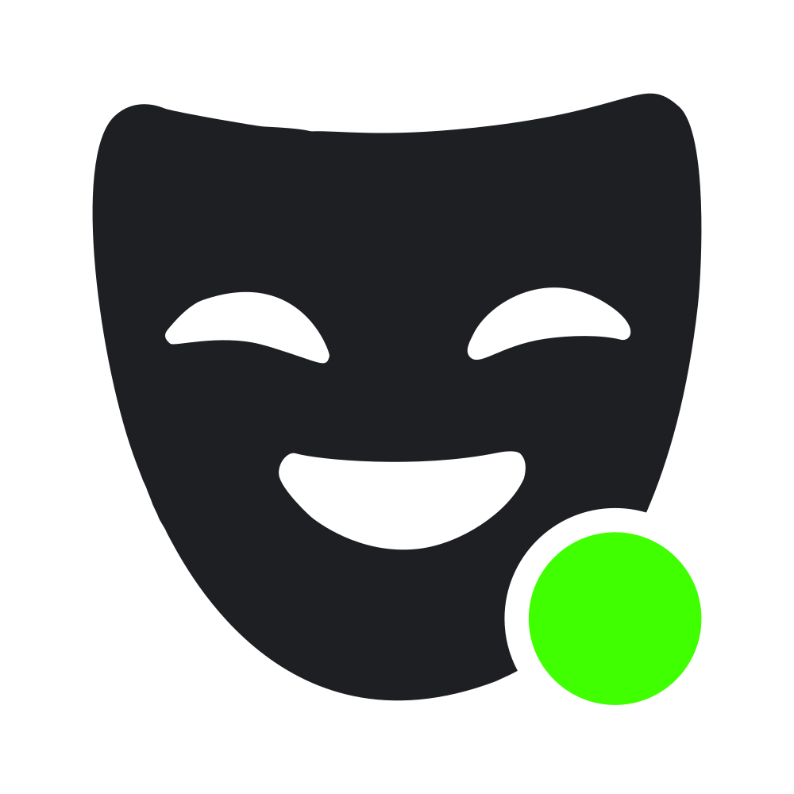

# Understudy

Understudy performs your Discord presence when your own client can't. It's a small self-hosted
server that watches what you're doing elsewhere and shows it on your Discord profile:
- "Watching Plex" (or Jellyfin, Emby, Trakt), with the poster and a progress bar;
- "Listening to Plex" (or Last.fm, ListenBrainz), with album art;
- "Playing Nintendo Switch" or "Playing Steam", with the game.


It doesn't need the Discord desktop app on the machine doing the playing.

- **Sources:**
  - **Plex** (via Tautulli): movies, episodes and music.
  - **Jellyfin / Emby**: movies, episodes and music.
  - **Trakt**: movies and episodes from anything that scrobbles to Trakt (Infuse, Kodi, browser
    extensions, …).
  - **Last.fm / ListenBrainz**: music from anything that scrobbles.
  - **Nintendo Switch** (via [nxapi](https://github.com/samuelthomas2774/nxapi)): Switch and
    Switch 2 games.
  - **Steam**: what you're playing, including on a Steam Deck in Game Mode.
  - **Manual**: set an activity from the web UI.
- **Output: Discord.**
  - Only while you're actually on Discord, with your real status.
  - Paused media is hidden.
  - Priority between sources, quiet hours, and a pause switch with an HTTP API.
- **Web UI** for setup, sign-ins and live status. Settings live in `/data`.

Sources and outputs are plugins, so more can be added (see [Architecture](#architecture)).

## Running

```sh
cp compose.example.yml compose.yml   # set UI_PASSWORD
docker compose up -d --build
```

Then open <http://localhost:8080>. For development:

```sh
pnpm install
pnpm dev        # http://localhost:8080, data in ./data
pnpm test
```

| Env var | Default | |
|---|---|---|
| `PORT` | `8080` | |
| `DATA_DIR` | `./data` (`/data` in Docker) | `config.json` (settings) and `state.json` (tokens). Both are mode 600. |
| `UI_PASSWORD` | unset | Basic-auth password for the web UI (any username). Set it: the UI holds your Discord tokens. |
| `PUBLIC_URL` | request origin | The URL you open the UI at, if that differs from what the server sees (e.g. behind a reverse proxy). Used for the OAuth redirect URI, and, if it's public HTTPS, for the optional artwork proxy. |
| `TZ` | system zone | Default time zone for quiet hours (e.g. `America/Chicago`). Each Discord output can override it. |
| `NXAPI_AUTH_CLIENT_ID` | unset | Default nxapi-auth client ID for the Nintendo Switch source. |
| `LOG_LEVEL` | `info` | `debug`, `info`, `warn` or `error` |

## Discord setup

1. In the [Developer Portal](https://discord.com/developers/applications), create an application.
   Its icon doesn't matter; the activity name comes from the source (e.g. "Plex").
2. **Discord Social SDK → Getting Started**: fill in the form and submit. Without this, login fails
   with `invalid_scope`.
3. **OAuth2**: turn on **Public Client**, and under **Redirects** add the URI shown on the Discord
   page of this app (`<your UI URL>/plugins/discord/callback`).
4. In the web UI: Discord → paste the **Application ID** → Save → **Connect Discord**.

If the redirect page can't load (e.g. you registered `localhost` but opened the UI from another
machine), copy the URL from the address bar and paste it into "Redirect page didn't load?".

Things to know:
- **One activity at a time.** When several sources are active, the Discord output picks one: by
  its source priority list (source ids, highest first), then the most recent.
- Paused activities are hidden by default, like Spotify's integration. The Discord settings can
  rank them last or show them instead.
- By default the activity is shown only while one of your real Discord clients (desktop, web or
  mobile) is online, idle or dnd ("Only while you are on Discord"). This keeps one extra Discord
  connection open with your login.
  - That connection carries the activity, with the same status as your real clients.
  - It's invisible whenever there's nothing to show, so others see exactly the status they would
    without this app.
- With that turned off, the activity is published as a **headless session** instead, which works
  with Discord closed. The catches:
  - a headless session makes you appear online, even while Invisible;
  - Discord doesn't really delete one when asked: it lingers, holding you online with no activity,
    for a few minutes afterwards.

- **Quiet hours** (Discord settings): daily times when nothing is shown, e.g. `23:00-07:00`, in
  the configured time zone.

## Pausing

The dashboard has a **Pause publishing** switch: 30 minutes, 1 hour, 4 hours, or until you resume.
While paused, the Discord output withdraws the activity. A pause survives restarts and ends by
itself when timed. To stop a single source or output, use its Disable button instead.

The same controls are available as a JSON API, using the UI password (any username). POST requests
must send `Content-Type: application/json`, which keeps them safe from cross-site forgery.

```sh
curl -u :PASSWORD http://localhost:8080/api/status            # pause state and every source/output
curl -u :PASSWORD -X POST -H 'Content-Type: application/json' -d '{"minutes": 60}' http://localhost:8080/api/pause
curl -u :PASSWORD -X POST -H 'Content-Type: application/json' -d '{}' http://localhost:8080/api/resume
curl -u :PASSWORD -X POST -H 'Content-Type: application/json' -d '{}' http://localhost:8080/api/toggle
```

`/api/pause` without `minutes` pauses until resumed. For example, a Home Assistant
`rest_command` that pauses while you're at a lecture:

```yaml
rest_command:
  understudy_pause:
    url: http://understudy.local:8080/api/pause
    method: post
    username: ha
    password: !secret understudy_password
    content_type: application/json
    payload: '{"minutes": 75}'
```

## Plex (Tautulli) setup

On the Plex (Tautulli) page, set:
- the **Tautulli URL** and **API key** (Tautulli → Settings → Web Interface → API);
- **Users**: your Plex username. Otherwise anyone streaming from your server shows up as you.

Discord loads artwork itself, so images must be public HTTPS URLs. In order:
1. **TMDB posters** for movies and shows, if you add a TMDB API key or read access token.
2. **iTunes album art** for music (no key needed).
3. Optionally, **Plex artwork served through this app**. This needs `PUBLIC_URL` to be an HTTPS
   address Discord can reach. Only signed image URLs under `/public/` work without the UI password.
4. A **fallback image**: a URL, or the key of an image uploaded to your Discord app (Developer
   Portal → Rich Presence → Art Assets).

The text lines are templates, e.g. `S{seasonPadded}E{episodePadded}[ · {episodeTitle}]`. Text in
`[brackets]` is dropped when a variable inside is empty. The settings page lists every variable.

## Jellyfin / Emby setup

On the Jellyfin / Emby page, set:
- the **Server type**;
- the **Server URL** (e.g. `http://jellyfin:8096`, with your base URL if you set one; for Emby,
  leave off `/emby`) and an **API key** (Jellyfin: Dashboard → API Keys; Emby: Settings → API Keys);
- **Users**: your username. Otherwise anyone playing from your server shows up as you.

Movies, episodes and music are shown, plus music videos and audiobooks. The activity is named after
the server type ("Watching Jellyfin") unless you set a name. Use **Clients or devices** to only show
some apps (e.g. `Finamp`) or devices (e.g. `Living Room TV`).

Artwork works as for Plex: TMDB posters (with a TMDB key), iTunes/Deezer album art, optionally the
server's own images served through this app (needs an HTTPS `PUBLIC_URL`), then a fallback image.
The text lines are templates too; the settings page lists every variable.

## Trakt setup

Trakt shows what you're watching in anything that scrobbles to it: Infuse, Kodi, browser
extensions for streaming sites, and so on. You need your own Trakt API app:

1. [Create an API app](https://app.trakt.tv/settings/apps/api/new) on Trakt. This needs a verified
   GitHub account connected to Trakt. Name it anything. For **Redirect URI** enter
   `urn:ietf:wg:oauth:2.0:oob`; this app signs in with a code, so it never redirects anywhere
   (Trakt may warn that it isn't an https address; that's fine here).
2. On the Trakt page of this app, enter the app's **Client ID**. The client secret is optional;
   Trakt has deprecated it.
3. Then either:
   - **Public profile:** set **Trakt username** to the name in your profile URL
     (`trakt.tv/users/<name>`). Nothing else is needed.
   - **Private profile:** choose **Connect Trakt**, open the link shown and enter the code. The
     page updates once you've approved it. Leave the username empty to show the connected account.
     Tokens are renewed automatically; **Disconnect** revokes and deletes them.

Trakt is polled every 30 seconds by default, and the progress bar follows Trakt's own start and
end times. Trakt has no paused state: when you pause, your player stops scrobbling and the
activity goes away. When Trakt limits requests, polling waits as long as it asks.

Trakt doesn't allow its own images to be hotlinked, so posters come from **TMDB** if you add a TMDB
API key or read access token, then from the **fallback image**. The buttons can link to IMDb (or
TMDB) and the Trakt page. The text lines are templates, as for Plex.

## Last.fm / ListenBrainz setup

Anything that scrobbles (Apple Music, YouTube Music, Tidal, Plexamp, a car stereo…) can show as
"Listening to Last.fm". On the Last.fm / ListenBrainz page, choose the **Service** and set:
- **Last.fm:** your **username** and an **API key**. Create one at
  <https://www.last.fm/api/account/create>; any name will do, and the callback URL can stay empty.
  Your recent listening must be public (Last.fm → Settings → Privacy).
- **ListenBrainz:** your **username**. A **user token** (listenbrainz.org → Settings) is optional;
  it's sent with each request if you set it.

Neither service says when a track started, so the elapsed time counts from when this app first saw
it (up to one poll interval late). A progress bar is shown only when the track's length is known
(ListenBrainz usually sends it; for Last.fm it's looked up once per track) and the app saw the track
start. Both services keep reporting a track for a while after you stop playing, so a track is hidden
2 minutes after it should have ended, or, if its length isn't known, after **Hide after** minutes.

Artwork, in order: Last.fm's own image, the Cover Art Archive (when the track has a MusicBrainz
release id), iTunes/Deezer album art (no key needed), then the **fallback image**.

If Plex or Jellyfin music also scrobbles (e.g. Plexamp to Last.fm), both sources report the same
track. The Discord output shows one of them, by its source priority list; put the one you prefer
higher.

## Nintendo Switch setup

Nintendo's API doesn't let you read your own presence, so this reads it from the friend list of a
**secondary Nintendo Account** that is friends with your main one. You need:

1. **A secondary Nintendo Account**, added as a friend of your main account. Your main account must
   share its online status with friends (on the Switch: System Settings → Users → your user →
   friend settings).
2. **An nxapi-auth client ID.** It identifies this app to nxapi's f-token API. Register once at
   <https://nxapi-auth.fancy.org.uk/oauth/clients>:
   - **Type:** Public. You can't change this later.
   - **Allowed grant types:** Client credentials and Refresh token.
   - **Scope:** in the *nxapi-znca-api* section, only f-generation, Request encryption and Response
     decryption (`ca:gf ca:er ca:dr`). Leave every other scope, and the client authentication
     section, alone.
   - **Details:** fill in a description and a contact URL.

   Enter the Client ID on the Nintendo Switch page, or set `NXAPI_AUTH_CLIENT_ID`. It isn't a
   secret.
3. **Sign in** on the Nintendo Switch page:
   - Read and accept the notice.
   - Open the sign-in link and sign in with the secondary account.
   - Right-click **Select this person**, copy the link (`npf71b963c1b7b6d119://auth#…`) and paste
     it back.
   - Pick your main account from the friend list.

> **Privacy:** Nintendo only accepts sign-ins from its own app. To sign in, this uses
> [nxapi-znca-api](https://github.com/samuelthomas2774/nxapi-znca-api), a third-party service.
> Your secondary account's Nintendo Account id_token, its Coral token, and data exchanged with
> Nintendo's Coral API are sent to that service. nxapi also loads its configuration from
> fancy.org.uk. Nothing is contacted until you accept the notice. See
> [what this means for you](https://github.com/samuelthomas2774/nxapi-znca-api/blob/docs/docs/end-user-help.md).
> The integration follows the service's
> [terms for clients](https://github.com/samuelthomas2774/nxapi-znca-api/blob/docs/docs/public-api-terms.md).

Presence is polled every 60 seconds by default. Games show as "Playing Nintendo Switch" (or
"Nintendo Switch 2"), with the game's icon and, if the game provides one, its status text.
After a network error polling backs off and continues, and it waits as long as nxapi-znca-api asks
(`Retry-After`). Any other error stops polling until you choose **Try again** on the Nintendo
Switch page, because the service's terms forbid other automatic retries.

## Steam setup

This shows what Steam says you're playing, so games on a Steam Deck in Game Mode (where Discord
isn't running) still show up. On the Steam page, set:
- a **Steam Web API key** from <https://steamcommunity.com/dev/apikey>. Any domain name will do.
  Steam may refuse keys to limited accounts (ones that have never spent money in the store).
- **Steam profile**: your SteamID64, your profile URL (`steamcommunity.com/profiles/…` or `/id/…`),
  or just your custom URL name.

Steam only reports your game if your profile's **Game details** are visible to the account the key
belongs to. Public (Steam → your profile → Edit Profile → Privacy Settings) is what's known to work;
**My profile** must be public too, since Game details can't be more public than it. If you're
Invisible or Offline on Steam, your game isn't shown either. **Test connection** warns when
Steam says the profile isn't visible.

Steam is polled every 30 seconds. Games show as "Playing Steam" (or whatever you set as the
activity name, e.g. "Steam Deck"), with the game's store header image and, optionally, a
"View on Steam" button. Non-Steam games added to Steam show by name, with the fallback image.

**Playing on a PC that runs Discord?** Then Discord already shows the game itself, and this would
show it a second time. Add those games to **Ignore games** (by name, or by the app id from the store
URL, e.g. `1145360` from `store.steampowered.com/app/1145360/`), so only games played elsewhere
(like on the Deck) come from here.

## Troubleshooting

- **The Discord page shows a session list.** Open "Your Discord clients" to see every session
  Discord reports: your clients, this app's connection, and any headless session. It's the quickest
  way to see why something is or isn't shown. Changes are also logged (see Log).
- **Shown as online after closing a browser tab.** Discord keeps a web client's session for a
  while after the tab closes, so Understudy keeps showing your activity until Discord drops it.
  The desktop app disconnects cleanly.
- **Nothing shows while you're Invisible.** That's deliberate: showing an activity would reveal
  that you're online.
- **`invalid_scope` when connecting Discord.** Enable the Social SDK for your app (see Discord
  setup).

## Architecture

```
src/
  core/        activity model, hub, plugin interfaces, registry, JSON stores, logger
  plugins/     sources and outputs; register new ones in plugins/index.ts
    discord/   OAuth (PKCE), REST client, headless session, activity mapping, publisher
    tautulli/  Plex via Tautulli: polling, filters, templates, artwork (TMDB, iTunes, signed proxy)
    jellyfin/  Jellyfin and Emby: session polling, filters, templates, artwork (TMDB, iTunes, signed proxy)
    trakt/     Trakt: watching polls, device-code sign-in with token refresh, templates, TMDB posters
    scrobbler/ Last.fm / ListenBrainz now playing: polling, first-seen timing, artwork (Cover Art Archive, iTunes)
    nintendo/  Nintendo Switch via nxapi: consent, sign-in, friend picker, presence polling
    steam/     Steam via the Web API: profile resolution, presence polling, store artwork
    shared/    helpers used by several sources: TMDB posters, album art, Retry-After, timestamp smoothing
    manual/    the hand-driven test source
  core/controls.ts   app-wide pause; core/schedule.ts   quiet-hour windows
  web/         Hono + JSX server-rendered UI with htmx, and settings forms built from zod schemas
```

A **source** calls `ctx.publish(nowPlaying | null)`. An **output** gets `onState(hubState)` with
every source's current activity. A plugin declares its settings as a zod schema, which also
generates its settings form. Plugins can add their own routes (under `/plugins/<instance>/`,
behind the UI password), public routes (under `/public/<instance>/`, for images and webhooks; they
must authenticate requests themselves) and UI panels. Each configured instance is restarted when its settings are saved.
